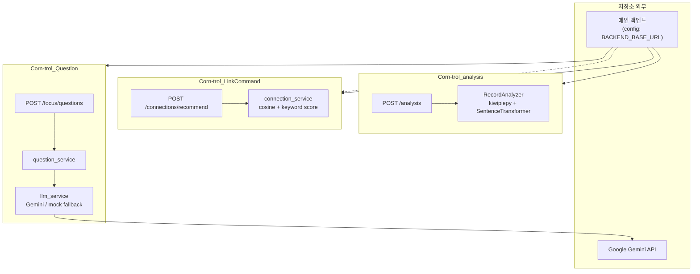

# Corn-trol AI 

Corn-trol 서비스의 **AI 마이크로서비스 레이어**입니다. 기록 텍스트 분석, 연결 추천, 집중 모드 질문 생성을 각각 독립 FastAPI 서비스로 제공합니다.

> 기준 브랜치: `5-Corn-trol-AI`

---

## 기술 스택

### 언어

| 항목 | 내용 |
|------|------|
| Python | `Corn-trol_LinkCommand/.python-version` → **3.11.9** |

### 프레임워크

| 서비스 | 프레임워크 |
|--------|------------|
| Corn-trol_LinkCommand | FastAPI `0.115.6` |
| Corn-trol_Question | FastAPI (버전 미고정) |
| Corn-trol_analysis | FastAPI (버전 미고정) |

### 라이브러리

| 구분 | Corn-trol_LinkCommand | Corn-trol_Question | Corn-trol_analysis |
|------|----------------------|-------------------|-------------------|
| API / 검증 | Pydantic `2.10.4`, pydantic-settings `2.7.1` | Pydantic | Pydantic (`main.py` 인라인 모델) |
| 수치 연산 | NumPy `1.26.4` | — | NumPy |
| 환경 변수 | python-dotenv `1.0.1` | python-dotenv | — (코드에서 미사용) |
| LLM | — | google-genai | — |
| 한국어 NLP | — | — | kiwipiepy |
| 임베딩 | — | — | sentence-transformers |

### 빌드 / 실행 도구

| 구분 | 내용 |
|------|------|
| ASGI 서버 | Uvicorn (`Corn-trol_LinkCommand`: `uvicorn[standard]==0.34.0`, 나머지: 버전 미고정) |
| 가상환경 | 각 서비스 폴더에서 `python -m venv` 사용 (`.gitignore`에 `venv/` 제외 설정) |

---

## 아키텍처 및 구조



**Corn-trol_analysis**는 사용자 기록 `content`를 받아 `topic`, `keywords`, 768차원 `embedding`을 생성합니다. `RecordAnalyzer`가 Kiwi 형태소 분석으로 키워드를 추출하고, `paraphrase-multilingual-mpnet-base-v2` 임베딩과 후보 라벨 유사도로 주제를 분류합니다.

**Corn-trol_LinkCommand**는 메인 백엔드가 넘긴 `sourceRecord`와 `candidateRecords`를 비교해 연결 대상 1건을 추천합니다. `similarity.py`의 코사인 유사도와 `score.py`의 키워드 점수를 합산(`0.7 : 0.3`)해 `finalScore`가 가장 높은 후보를 선택합니다.

**Corn-trol_Question**은 집중 모드용 질문을 생성합니다. `focus` 라우터가 요청을 받으면 `question_service`가 응답 형식을 맞추고, `llm_service`가 Gemini 프롬프트 호출 또는 mock 질문으로 결과를 반환합니다.

세 서비스는 **폴더 단위로 분리**되어 있으며, 각각 독립 `requirements.txt`와 FastAPI 앱 엔트리(`main.py`)를 가집니다. 

---

## 핵심 구현 포인트

### 1. 기록 분석 파이프라인 (`Corn-trol_analysis/analyzer.py`)

`RecordAnalyzer`가 초기화 시 `Kiwi` 토크나이저와 `SentenceTransformer` 모델, 7개 `candidate_labels` 임베딩을 한 번에 로드합니다. `analyze_all()`은 텍스트 정규화 → 키워드 추출(`NNG`, `NNP`, `SL`) → 문장 임베딩 → 라벨 코사인 유사도 비교 순으로 `topic`·`keywords`·`embedding`을 반환합니다.

### 2. 하이브리드 연결 추천 (`Corn-trol_LinkCommand/app/services/connection_service.py`)

`recommend_connection()`이 후보마다 `cosine_similarity()`와 `calculate_keyword_score()`를 계산하고, `calculate_final_score()`로 가중 합산합니다. `candidateRecords`가 비어 있으면 `targetRecordId: null`과 점수 `0.0`을 반환해 빈 결과도 API 계약을 유지합니다.

### 3. Gemini 질문 생성 및 fallback (`Corn-trol_Question/services/llm_service.py`)

`build_question_prompt()`로 질문 개수·JSON 출력·한국어 등 규칙을 고정하고, `generate_questions_with_gemini()`가 `gemini-2.5-flash`를 호출합니다. API 키가 없거나 파싱·호출이 실패하면 `generate_mock_questions()`로 대체해 서비스가 중단되지 않게 했습니다.

### 4. API 계층 분리 (LinkCommand / Question)

LinkCommand는 `connection_router` → `connection_service` → `schemas.py`로 라우팅·로직·DTO를 분리했습니다. Question은 `routers/focus.py` → `question_service.py` → `models/focus_schema.py` 구조로 요청·응답 스키마를 Pydantic으로 고정합니다.

### 5. 환경 설정 분리 (`Corn-trol_LinkCommand/app/config.py`)

`pydantic-settings`의 `Settings`가 `.env`에서 `APP_NAME`, `HOST`, `PORT`, `BACKEND_BASE_URL` 등을 읽습니다. 로컬/배포 환경 전환 시 앱 코드 수정 없이 설정만 변경할 수 있게 했습니다.

---

## 트러블슈팅 및 기술적 고민

| 항목 | 내용 |
|------|------|
| **로컬 포트 충돌 가능성** | 세 서비스 모두 Uvicorn 기본 포트 `8000` 사용 가능. LinkCommand만 `config.py`에서 `PORT=8000` 명시. 동시 기동 시 포트 분리 필요 |
| **분석 서비스 초기 기동 부담** | `RecordAnalyzer.__init__`에서 Kiwi·SentenceTransformer·라벨 임베딩을 모두 로드. 첫 요청 전 메모리·시간 비용 발생 |
| **LLM 오류 처리 단순화** | `llm_service.py`에서 예외 시 `print` 후 mock 반환. 운영 관측·재시도 정책은 미정의 |
| **의존성 버전 정책 불일치** | LinkCommand는 버전 고정, Question·analysis는 미고정. 환경 재현성 차이 가능 |

---

## 설치 및 실행 방법

### 공통 사전 요구

- Python **3.11.9** 권장 (`Corn-trol_LinkCommand/.python-version` 기준)
- 각 서비스 폴더에서 **별도 가상환경** 권장

### 1) Corn-trol_analysis

```bash
cd Corn-trol_analysis
python -m venv venv
# Windows
venv\Scripts\activate
# macOS / Linux
# source venv/bin/activate

pip install -r requirements.txt
uvicorn main:app --reload --host 0.0.0.0 --port 8002
```

- 확인 URL: `http://127.0.0.1:8002/docs`
- 주요 API: `POST /analysis`

---

### 2) Corn-trol_LinkCommand

```bash
cd Corn-trol_LinkCommand
python -m venv venv
venv\Scripts\activate   # Windows

pip install -r requirements.txt
```

프로젝트 루트(`Corn-trol_LinkCommand/`)에 `.env` 생성 (선택, 미설정 시 기본값 사용):

```env
APP_NAME=Corn-trol AI Server
APP_VERSION=0.1.0
ENV=local
HOST=0.0.0.0
PORT=8000
BACKEND_BASE_URL=http://localhost:8080
```

```bash
uvicorn app.main:app --reload --host 0.0.0.0 --port 8000
```

- 확인 URL: `http://127.0.0.1:8000/docs`, `GET /health`
- 주요 API: `POST /connections/recommend`

---

### 3) Corn-trol_Question

```bash
cd Corn-trol_Question
python -m venv venv
venv\Scripts\activate

pip install -r requirements.txt
```

`.env` 생성 (**Gemini 사용 시 필요**):

```env
GEMINI_API_KEY=your_api_key_here
```

> `GEMINI_API_KEY`가 없으면 `llm_service.py`가 mock 질문으로 동작합니다.

```bash
uvicorn main:app --reload --host 0.0.0.0 --port 8001
```

- 확인 URL: `http://127.0.0.1:8001/docs`
- 주요 API: `POST /focus/questions`

---

### API 요청 예시 (Swagger / curl)

**분석**

```json
POST /analysis
{
  "recordId": 1,
  "userId": "1",
  "content": "아이디어를 떠올려도 금방 잊어버려서 기록을 연결해주는 서비스가 있으면 좋겠다."
}
```

**연결 추천**

```json
POST /connections/recommend
{
  "userId": 1,
  "sourceRecord": {
    "recordId": 2,
    "topic": "스터디/학습",
    "keywords": ["GDGOC", "스터디", "노션"],
    "embedding": [0.79, 0.77, 0.74, 0.21, 0.15]
  },
  "candidateRecords": [
    {
      "recordId": 16,
      "topic": "스터디/학습",
      "keywords": ["스터디", "노션"],
      "embedding": [0.78, 0.76, 0.73, 0.22, 0.16]
    }
  ]
}
```

**집중 질문**

```json
POST /focus/questions
{
  "userId": 1,
  "recordId": 2,
  "topic": "집중력 저하",
  "currentRecord": {
    "content": "숏폼을 보면 생각을 오래 붙잡지 못한다.",
    "keywords": ["숏폼", "집중"]
  },
  "linkedRecords": []
}
```

---

## 폴더 구조

```
Corn-trol_AI/                    # 5-Corn-trol-AI 브랜치 루트
│
├── Corn-trol_analysis/          # 기록 분석 (주제·키워드·임베딩)
│   ├── main.py                  # FastAPI 앱 · POST /analysis 요청 처리
│   ├── analyzer.py              # Kiwi 키워드 추출 + mpnet 임베딩 + 7개 주제 라벨 분류
│   └── requirements.txt         # FastAPI, Kiwi, sentence-transformers 등 의존성
│
├── Corn-trol_LinkCommand/       # 기록 연결 추천
│   ├── app/
│   │   ├── main.py              # FastAPI 엔트리 · 라우터 등록 · GET /health
│   │   ├── config.py            # .env 기반 HOST, PORT, BACKEND_BASE_URL 로드
│   │   ├── schemas.py           # sourceRecord·candidateRecords 요청/응답 DTO
│   │   ├── api/
│   │   │   └── connection_router.py   # POST /connections/recommend 엔드포인트
│   │   ├── services/
│   │   │   └── connection_service.py  # 후보별 점수 비교 후 finalScore 최고 1건 반환
│   │   └── utils/
│   │       ├── similarity.py    # 임베딩 벡터 코사인 유사도 계산
│   │       └── score.py         # 키워드 교집합 점수 · 0.7/0.3 가중 최종 점수
│   ├── requirements.txt
│   └── .python-version
│
└── Corn-trol_Question/          # 집중 모드 질문 생성 (Gemini)
    ├── main.py                  # FastAPI 엔트리 · /focus 라우터 마운트
    ├── routers/
    │   └── focus.py             # POST /focus/questions · question_service 호출
    ├── services/
    │   ├── llm_service.py       # Gemini 프롬프트·JSON 파싱 · 실패 시 mock 질문
    │   └── question_service.py    # LLM 결과를 id·questionText·createdAt 응답으로 변환
    ├── models/
    │   └── focus_schema.py      # currentRecord, linkedRecords 요청/응답 스키마
    ├── data/
    │   └── mock_records_example.py   # Swagger·로컬 테스트용 기록 예시
    └── requirements.txt
```

| 폴더 | 역할 |
|------|------|
| `Corn-trol_analysis` | 텍스트 → `topic` / `keywords` / `embedding` 생성 |
| `Corn-trol_LinkCommand` | 임베딩·키워드 기반 연결 후보 1건 추천 |
| `Corn-trol_Question` | 집중 모드용 AI 질문 생성 (Gemini + mock fallback) |

---

## 향후 개선 사항

### 에러 처리 및 로깅 체계화

LLM 호출 실패 시 `print`로만 처리하고 있습니다. HTTP 상태 코드·에러 메시지 표준화와 구조화된 로깅(요청 ID, 실패 원인 등)을 도입해, 운영 시 원인 파악이 쉽도록 개선할 예정입니다.
