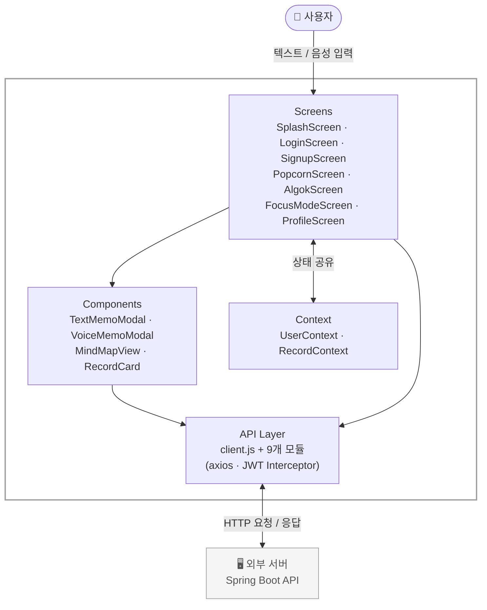

# Corn-trol — React Native

> Corn-trol 서비스의 React Native 프론트엔드 브랜치입니다

---

## 주요 기능

| 기능 | 설명 | 관련 파일 |
|------|------|-----------|
| 팝콘 수집기 | 텍스트/음성으로 짧은 생각 기록, 날짜별 팝콘 개수 시각화 | `PopcornScreen.jsx`, `TextMemoModal.jsx`, `VoiceMemoModal.jsx` |
| 알곡 꿰기 | AI 분석 결과를 마인드맵으로 시각화, 유사 기록 간 연결선(생각줄기) 표시 | `AlgokScreen.jsx`, `MindMapView.jsx` |
| 알곡 식히기 | 기록 선택 시 AI 사고 확장 질문 생성, 원형 타이머 기반 집중 모드 | `FocusModeScreen.jsx` |
| 기록 수정 후 재분석 | 기록 수정 시 AI 재분석 + 연결 추천 + 마인드맵 즉시 반영 | `AlgokScreen.jsx` |
| 푸시 알림 | 집중 모드 타이머 종료 시 푸시 알림 | `FocusModeScreen.jsx` |
| 콘 프로필 | 팝콘 개수, 알곡 식히기 횟수, 생각줄기 수 통계 | `ProfileScreen.jsx` |

---

## 기술 스택

### 언어 / 프레임워크
- **React Native** (Expo)
- **JavaScript**

### 주요 라이브러리

| 분류 | 라이브러리 |
|------|-----------|
| 네비게이션 | `@react-navigation/native`, `@react-navigation/bottom-tabs`, `@react-navigation/stack` |
| HTTP | `axios` |
| 음성 녹음 | `expo-av` |
| 그래픽 | `react-native-svg`, `react-native-svg-transformer` |
| 안전 영역 | `react-native-safe-area-context` |
| 저장소 | `@react-native-async-storage/async-storage` |
| 알림 | `expo-notifications` |
| 폰트 | `expo-font` (Pretendard) |
| 상태 감지 | `AppState` API (React Native 내장) |

---

## 아키텍처 및 구조



**기록 저장 시 API 흐름:**
```
POST /records → POST /analysis → POST /connections/recommend → POST /connections
```

- `Screens`: `src/screens/` 7개 파일
- `Components`: `src/components/` 4개 파일
- `Context`: `src/context/UserContext.js`, `RecordContext.js`
- `API Layer`: `src/api/` 9개 모듈, axios 기반 `client.js`

---

## 핵심 구현 포인트

### 1. JWT 자동 갱신 (Axios Interceptor)
`src/api/client.js`에서 Axios 응답 인터셉터를 구현해, 401 응답 시 `AsyncStorage`에 저장된 refreshToken으로 자동 재발급합니다. 갱신 실패 시 토큰 전체를 삭제하고 로그인 화면으로 유도합니다. AI 분석 서버의 응답 지연을 고려해 timeout은 120초로 설정했습니다.

### 2. 마인드맵 SVG 시각화
`react-native-svg`로 중앙 키워드 노드 + 자식 노드를 원형 배치해 마인드맵을 렌더링합니다. `getMindMap` API에서 `nodes`와 `links`를 받아 기록 간 연결선(점선)을 표시합니다.

### 3. 알곡 식히기 타이머 - 백그라운드 대응
`AppState` API로 백그라운드/포그라운드 상태를 감지합니다. 백그라운드 진입 시 `endTime`을 저장하고, 포그라운드 복귀 시 남은 시간을 계산해 타이머를 이어갑니다. `expo-notifications`로 타이머 종료 알림을 예약/취소하며, 타이머 완료는 `timerCompleted` state로 side effect를 처리합니다.

### 4. AI 질문 생성 로직 - Fallback 처리
1차 생성 요청 실패 시 기존 질문을 조회하고, 없으면 2차 생성 요청을 보내는 fallback 로직을 구현했습니다. `isLoadingQuestions` state로 "AI 질문 생성 중..." 상태를 표시합니다.

### 5. Context 기반 즉시 반영
`RecordContext`의 `lastSaved` 트리거로 기록 저장 시 팝콘 화면이 즉시 반영됩니다. `updateRecordLocal`로 수정 후 API 재호출 없이 로컬 상태를 즉시 업데이트해 UX를 개선했습니다.

### 6. 중복 저장 방지
`isSaving` state로 저장 버튼 중복 탭을 방지하고, 저장 즉시 모달을 닫은 뒤 API 호출은 백그라운드에서 처리해 체감 응답 속도를 높였습니다.

---

## 트러블슈팅 및 기술적 고민

### 1. 음성 파일 포맷 문제 (expo-av m4a → WAV)
`expo-av`의 기본 녹음 포맷이 m4a라 Python AI 서버(Whisper)에서 파일을 읽지 못하는 문제가 발생했습니다. iOS는 `LINEARPCM` 포맷, 16000Hz, 1채널, 16bit WAV로 강제 설정해 Whisper STT와의 호환성을 확보했습니다.

```javascript
ios: {
  extension: ".wav",
  outputFormat: Audio.IOSOutputFormat.LINEARPCM,
  sampleRate: 16000,
  numberOfChannels: 1,
  linearPCMBitDepth: 16,
}
```

### 2. Stale Closure 문제 (PanResponder)
`MindMapView.jsx`와 `RecordCard.jsx`에서 PanResponder 내부의 `onEdit`, `onDelete` 콜백이 초기값을 참조하는 stale closure 문제가 발생했습니다. `useRef`로 최신 콜백을 항상 유지해 해결했습니다.

### 3. 기록 수정 후 마인드맵 즉시 반영
기록 수정 후 AI 재분석까지 5~10초 소요되는 동안 수정 전 내용이 그대로 표시되는 문제가 있었습니다. `updateRecordLocal`과 `setMindMapData`로 로컬 상태를 즉시 반영해 사용자가 수정 결과를 바로 확인할 수 있도록 개선했습니다.

### 4. onLongPress 동작 안함
`TouchableOpacity`에서 `onLongPress`가 정상 동작하지 않는 문제가 있었습니다. `Pressable` + `delayLongPress={300}`으로 교체해 해결했습니다.

### 5. 백엔드 401/403 응답 불일치
토큰 만료 시 백엔드에서 403을 반환해 자동 갱신 인터셉터가 동작하지 않는 문제가 있었습니다. JwtFilter를 수정해 토큰 만료 시 401을 반환하도록 백엔드 팀과 협업해 해결했습니다.

### 6. 분석 완료 전 연결 추천 요청
`await requestAnalysis` 이후 연결 추천을 요청해도 AI 서버의 분석이 비동기로 처리되어 `mainTopic`이 null로 반환되는 문제가 있었습니다. 현재는 프론트에서 순차 요청으로 처리하고 있으며, 백엔드에서 분석 완료 후 자동으로 연결 추천을 트리거하는 방향으로 개선을 논의 중입니다.

---

## 설치 및 실행 방법

```bash
# 의존성 설치
npm install

# Expo 개발 서버 실행
npx expo start
```

> iOS / Android 모두 Expo Go 앱으로 실행 가능합니다.

---

## 폴더 구조

```
src/
├── api/              # Axios 기반 API 호출 모듈 (9개)
│   ├── client.js     # JWT 인터셉터, baseURL, timeout 설정
│   ├── auth.js       # 로그인, 회원가입, 토큰 갱신
│   ├── records.js    # 기록 CRUD
│   ├── analysis.js   # AI 분석 요청
│   ├── connection.js # 연결 추천 및 생성
│   ├── focus.js      # 집중 모드 세션
│   ├── media.js      # 음성 파일 업로드
│   ├── report.js     # 통계 조회
│   └── user.js       # 사용자 정보
├── components/       # 재사용 컴포넌트
│   ├── MindMapView.jsx     # SVG 마인드맵 시각화
│   ├── RecordCard.jsx      # 기록 카드 컴포넌트
│   ├── TextMemoModal.jsx   # 텍스트 기록 모달
│   └── VoiceMemoModal.jsx  # 음성 기록 모달 (파형 애니메이션)
├── context/          # 전역 상태 관리
│   ├── UserContext.js
│   └── RecordContext.js    # records, groupedRecords, lastSaved, updateRecordLocal
├── screens/          # 화면 단위 컴포넌트
│   ├── SplashScreen.jsx
│   ├── LoginScreen.jsx
│   ├── SignupScreen.jsx
│   ├── PopcornScreen.jsx
│   ├── AlgokScreen.jsx
│   ├── FocusModeScreen.jsx
│   └── ProfileScreen.jsx
└── theme/
    └── index.js      # 공통 색상, spacing, typography
assets/
├── fonts/            # Pretendard (Bold, Medium, Regular, SemiBold)
└── *.svg / *.png     # 앱 아이콘, 팝콘 이미지
```

---

## 배운 점

- **React Native 플랫폼 대응**: iOS와 Android의 SafeArea, 음성 녹음 포맷, 키보드 처리 등 플랫폼별 차이를 직접 다루며 크로스플랫폼 개발의 복잡성을 경험했습니다.
- **JWT 인증 흐름 구현**: Axios 인터셉터를 활용한 토큰 자동 갱신 패턴을 직접 구현하며 인증 흐름 전반을 이해했습니다.
- **백엔드/AI 팀과의 API 협업**: 응답 스펙 불일치(401/403), 비동기 처리 타이밍 문제 등 실제 협업에서 발생하는 이슈를 경험하고 대응하는 방법을 배웠습니다.
- **Context API 상태 설계**: 여러 스크린에서 공유되는 기록 데이터를 Context로 관리하며, 로컬 즉시 반영과 API 재호출 최소화를 고려한 상태 설계를 경험했습니다.
- **SVG 기반 커스텀 시각화**: 라이브러리 없이 `react-native-svg`로 마인드맵을 직접 렌더링하며 좌표 계산과 레이아웃 설계를 경험했습니다.
- **AppState를 활용한 백그라운드 처리**: 타이머 앱에서 백그라운드 진입 시 시간 보정 로직을 직접 구현하며 모바일 앱의 생명주기를 이해했습니다.

---

## 향후 개선 사항

- 알곡 식히기 질문 박스 높이 고정 (타이머 레이아웃 흔들림 개선)
- 마인드맵 인터랙션 개선 (핀치 줌, 드래그 스크롤)
- EAS Build로 iOS 배포 (TestFlight)
- 오프라인 기록 임시 저장 기능
