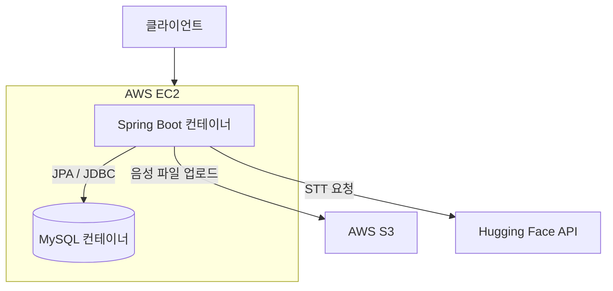

# Corn-trol
> Corn-trol 서비스의 백엔드 인프라 코드가 관리되는 브랜치입니다.

## 기술 스택

- **Language:** Java 21
- **Framework:** Spring Boot
- **Database:** MySQL, Spring Data JPA
- **Infrastructure:** AWS EC2, Docker, GitHub Actions
- **Cloud & API:** AWS S3, Hugging Face API (Whisper-large-v3-turbo)
- **Security:** Spring Security, JWT Auth
- **Mail:** Java Mail Sender (SMTP)

## 아키텍처 및 구조



- `Spring Boot 컨테이너`: `Dockerfile` 및 `src/main/java` 구조를 근거로 작성 (내장 Tomcat 사용)
- `MySQL 컨테이너`: AWS RDS를 사용하지 않고 EC2 내부에 직접 데이터베이스 컨테이너를 구성하여 운영
- `AWS S3`, `Hugging Face API`: `MediaController` 및 외부 연동 서비스 클래스 기준 작성

## 핵심 구현 포인트

1. **외부 AI 연동 및 음성 처리 파이프라인 구축**
   - 클라이언트로부터 전달받은 음성 파일을 AWS S3에 업로드하고, Hugging Face Whisper API를 호출하여 텍스트로 변환합니다.
   - 다양한 오디오 포맷 변환(ffmpeg) 과정에서 발생할 수 있는 예외 처리 로직을 구축하여 시스템의 안정성을 확보했습니다.

2. **도메인 주도 설계(DDD) 기반의 패키지 분리**
   - 확장성과 유지보수성을 고려하여 `analysis`, `connection`, `focus`, `media`, `notification` 등 핵심 비즈니스 로직을 도메인 단위로 명확하게 분리하여 설계했습니다.

3. **안전한 자동화 배포 환경(CI/CD) 구축**
   - GitHub Actions 환경 변수(`secrets`)를 활용하여 DB 암호, JWT 시크릿 키, AWS 자격 증명 등을 안전하게 컨테이너 환경으로 주입하도록 배포 자동화 파이프라인(`deploy.yml`)을 구축했습니다.
     
## 트러블슈팅 및 기술적 고민

### 외부 API 실패 시 클라우드 스토리지 리소스 누수 방지
- **문제 상황:** STT 변환 과정(ffmpeg 오디오 변환 실패 또는 AI API 응답 지연 등)에서 예외가 발생할 경우, AWS S3에 이미 업로드된 임시 미디어 파일이 삭제되지 않고 영구적으로 남아 클라우드 유지 비용이 발생하는 리스크가 존재했습니다.
- **해결 방안:** `MediaController` 및 `WhisperService` 흐름 내에 강력한 예외 처리(`try-catch`) 블록을 구현했습니다. 예외 발생 시, 즉각적으로 S3 객체 URL을 추적하여 버킷에서 해당 파일을 물리적으로 삭제하는 롤백(Rollback) 로직을 추가했습니다.
- **결과:** 시스템 오류 시 불필요한 스토리지 과금을 원천적으로 방어하고, 사용자 개인정보(음성 데이터)가 버려진 채 방치되는 보안 리스크를 제거했습니다.

## 설치 및 실행 방법

### 요구 사항
- Java 21
- Docker
- 환경 변수 설정 (데이터베이스 정보, AWS 자격 증명, JWT 시크릿 등)

### 로컬 환경 실행
1. 레포지토리를 클론합니다.
```bash
git clone https://github.com/Seoyoung0519/Corn-trol.git
cd Corn-trol_Backend
```
2. 깃허브에 업로드된 src/main/resources/application.yml 파일을 확인하고, 본인의 로컬 환경에 맞춰 필수 환경 변수(DB 계정, API Key 등)를 주입하거나 파일 내에 직접 작성합니다.
3. Gradle을 이용하여 빌드 및 실행합니다.
```bash
./gradlew clean build -x test
java -jar build/libs/corntrol-0.0.1-SNAPSHOT.jar
```

## 폴더 구조

```text
Corn-trol_Backend
├── .github                 # CI/CD 파이프라인 (deploy.yml)
├── src
│   └── main
│       ├── java/com/corntrol/corntrol
│       │   ├── domain      # 핵심 비즈니스 도메인 (analysis, focus 등)
│       │   └── CorntrolApplication.java
│       └── resources       # 환경 설정 파일
├── build.gradle            # 프로젝트 의존성 관리
└── Dockerfile              # 컨테이너 이미지 빌드 설정
```
- `domain`: 기능별 응집도를 높이기 위해 도메인별로 디렉토리를 분리하여 관리합니다.
- `.github`: `main` 브랜치 병합 시 자동화된 배포를 수행하기 위한 설정이 포함되어 있습니다.

## 향후 개선 사항

- **테스트 코드 보강:** 현재 빌드 시 제외된(`-x test`) 단위 테스트 및 통합 테스트를 촘촘하게 작성하여 서비스 신뢰성을 높일 계획입니다.
- **로깅 및 모니터링 시스템 도입:** EC2 내에서 동작하는 Spring Boot 및 MySQL 컨테이너의 상태를 실시간으로 추적하기 위해 환경을 구축할 예정입니다.
